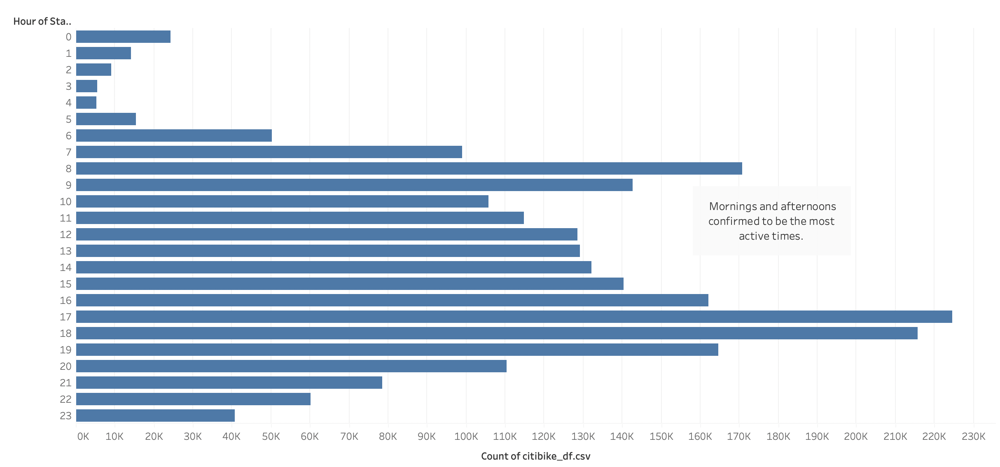

# Bikesharing

## Overview

For this analysis, I will be using Tableau to visualize data from a bike sharing company based in New York City called CitiBike. The purpose of this analysis is to identify patterns of use that can be used to duplicate the apps success in Des Moines, Iowa. From the economy to population size, it is no secret that there are stark differences between Des Moines Iowa, and New York City. With the differences of the two cities in mind, I will turn my focus to the users in order to find out why the app garners such success in NYC.

All of the key findings mentioned in this repo can be viewed within my tableau page, with the title "Final Story". Another thing worth noting is the ipynb file type that can be found within this repository. The ipynb file is a jupyter notebook featuring the python programming language, the file was used to convert the the "trip_duration" column to a date time format. Since tableau is best used for visualiztions, it was best to change the format of this column with the pandas library. 

## Results

For this section I will provide the visualizations that I was able to generate with tableau and give a brief summary of each image.

1. 

   - The image above shows the starting locations of each bike trip. The size and color of the markers are indicative of the amount of trips that started in each location.
     -  We see a large concentration of trips beginning at the center of the map. 
        - The center of the map is home to some of New Yorks biggest tourist attractions including Central Park, Times Square and the Empire State Building.
        - Tourism is a potential cause of the high bike usage.
2. 
   
   - The image above is a heatmap showing the most popular times for the beginning of trips. The darker the cell, the more bikes used at that time.
     - We can see that early mornings and afternoons generate the highest usage.
3. 
   
   - The image above is a bar chart showing the most active times on a 24 hour clock.
     -  This image confirms the results of the heatmap, indicating that usage of the bikes is highest in the mornings and afternoons.
     -  Since a lot of usage comes during the weekday, it is a fair assumption that the bikes attract the working class.

4.

  - The image above shows the average trip duration of users.
     - Most users use the bike for less than 30 minutes.
     - The biggest bike usage comes around 10 minutes.
       - Conveniance seems to be a major factor.

### User Demographics

5. 
   
   - The image above is the trip duration of users categorized by gender.
     - Far less female users, but we see similar trends.

6. 
   
   - The image above shows the previous heatmap categorized by gender.
     -  Male and Female users exhibit the same patterns with in time use, just with far less female users.

7. 
   
   - Heatmap categorized between customer type and gender.
     - Most casual users use the app on the weekend.
 
## Summary

The visualizations above show two reoccurring themes for CitiBike, the first theme is that working class seems to be the backbone of the bike sharing company. With such a high usage occuring in the mornings and afternoons, as well as the trip durations typically being less than 10 minutes. It is clear that the biggest factor to our success in Des Moines is going to be the recruitment of the working class. 

A potential factor to the use of the bikes for the working class could be the traffic of NYC. To further drive our research, I suggest a look at the traffic patterns in Des Moines. If there is high traffic in Des Moines, it will be a great sign for our venture. After a look at the traffic patterns, we need to ensure that the typicall distance to work with the bikes would not go above our 30 minute ideal time range, it would be even better if we could do it in 10 minutes or less. 

The second theme that we see is a startling one, and that is the low usage of the bikes among women. This issue is a little bit more complex than the previous one, as there does not appear to be any clear reason why the app does not perform well among women in NYC. The first key to solving this issue will be taking a look at the prefered modes of transportation for women in NYC. If we can imitate those features, and advertise them in Des Moines, maybe we can close the gap in app usage between women and men. 

One thing is clear though, and that is that with such a sharp difference in population size between the two cities, the successful recruitment of Female users will be key to the success of the bike sharing service in Des Moines. 

